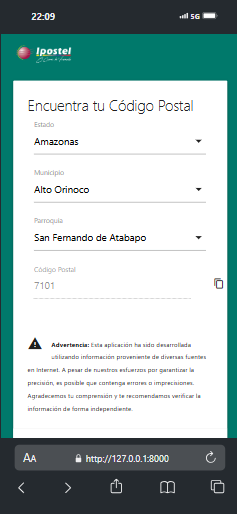

# Codposven

**Codposven** es una aplicación web que permite a los usuarios buscar de manera rápida y sencilla los **códigos postales** de los estados, municipios y parroquias de **Venezuela**. El objetivo principal de la aplicación es ayudar a los usuarios a encontrar el código postal correspondiente a su ubicación.

## Preview


## Tecnologías Utilizadas

La aplicación fue desarrollada utilizando las siguientes tecnologías:

- **[Laravel](https://laravel.com/)**: Framework PHP utilizado para el backend y la gestión de la lógica de la aplicación.
- **[MaterializeCSS](https://materializecss.com/)**: Framework CSS basado en Material Design, que proporciona una interfaz de usuario moderna y adaptable.
- **[Vue.js](https://vuejs.org/)**: Framework JavaScript utilizado en el frontend para la creación de una experiencia de usuario dinámica e interactiva.
- **[Axios](https://axios-http.com/)**: Librería para realizar solicitudes HTTP desde el frontend, facilitando la comunicación con el backend.
- **[MySQL](https://www.mysql.com/)**: Sistema de gestión de bases de datos utilizado para almacenar los estados, municipios, parroquias y códigos postales.

## Características

- Búsqueda rápida de códigos postales por estado, municipio o parroquia.
- Interfaz amigable y fácil de usar.
- Listado completo de todas las regiones de Venezuela con sus respectivos códigos postales.

## Instalación

Sigue los siguientes pasos para instalar y ejecutar la aplicación localmente:

1. Clonar este repositorio:
    ```bash
    git clone https://github.com/jesanrocks/codposven.git
    ```

2. Navegar al directorio del proyecto:
    ```bash
    cd codposven
    ```
3. Instalar dependencias de Laravel:
    ```bash
    composer install
    ```
4. Configurar las variables de entorno:
    Copia el archivo `.env.example` a `.env` y modifica las configuraciones necesarias como la base de datos.

5. Ejecutar las migraciones y seeders para crear las tablas y poblarlas con los datos iniciales:
    ```bash
    php artisan migrate --seed
    ```
6. Iniciar el servidor local de desarrollo:
    ```bash
    php artisan serve
    ```
Ahora puedes acceder a la aplicación en `http://localhost:8000`.

## Objetivos Futuros

- Desplegar una **API** que permita a los clientes externos consumir la información de los códigos postales de manera programática.
- Mejorar la precisión de los datos y corregir posibles errores en la información disponible.

## Nota de Advertencia

> **Advertencia**: La información proporcionada en esta aplicación fue recopilada de varias fuentes disponibles en internet. Si bien hemos hecho esfuerzos para garantizar su precisión, puede contener **errores o imprecisiones**. Por lo tanto, se recomienda verificar los datos antes de realizar cualquier uso crítico de la información.

## Contribuciones

Las contribuciones son bienvenidas. Si encuentras algún error o deseas agregar alguna funcionalidad, por favor abre un **pull request** o crea un **issue** en este repositorio.

## Licencia

Este proyecto está bajo la licencia [MIT](https://opensource.org/licenses/MIT).
